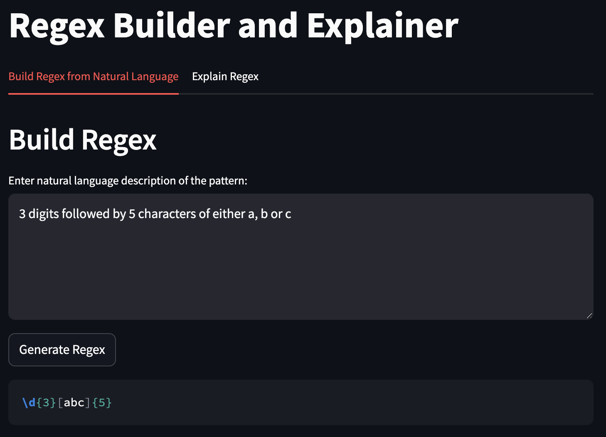
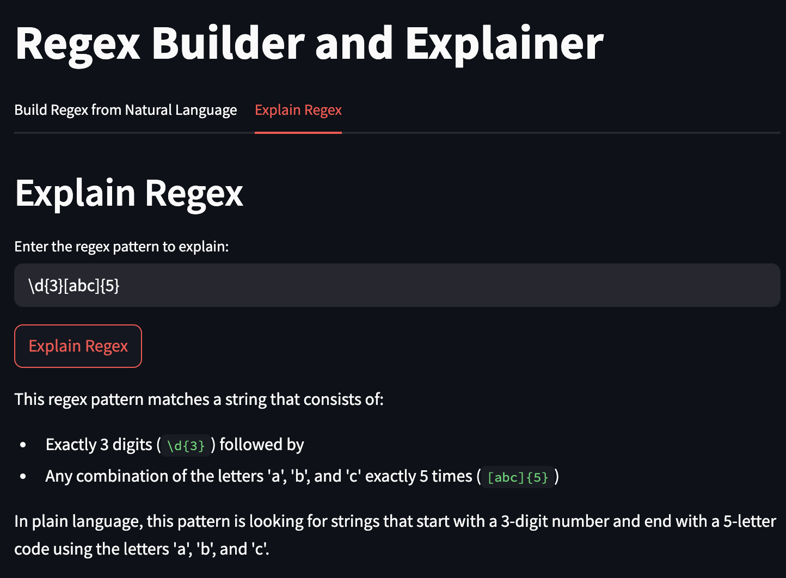

# 🤖 Regex Builder and Explainer (LLM-Powered)

A simple and interactive Streamlit application that uses a language model to build regular expressions from natural language and explain regex patterns in plain English.

## 🧠 Features

- Generate regular expressions from natural language descriptions
- Explain complex or simple regex patterns in clear, human-friendly language
- Two-tab interface for easy switching between building and explaining
- Real-time responses powered by LLM via LangChain

## Screenshots

_Building a Regex_

_Explaining a Regex_

## ⚙️ Technologies Used

- Streamlit for UI
- LangChain for LLM orchestration
- dotenv for environment variable management
- Groq (or compatible LLM provider) for model inference

## 📂 Structure

- `app.py`: Main application script
- `.env`: Environment configuration for API keys (excluded from version control)
- `requirements.txt`: Python dependencies
